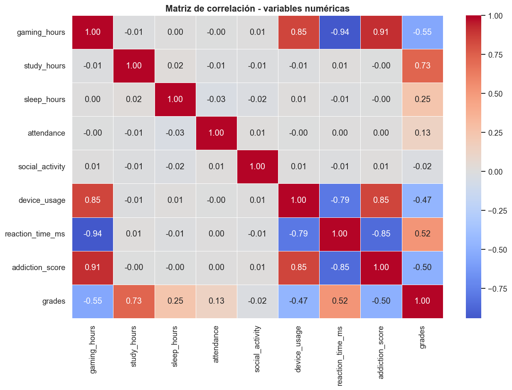
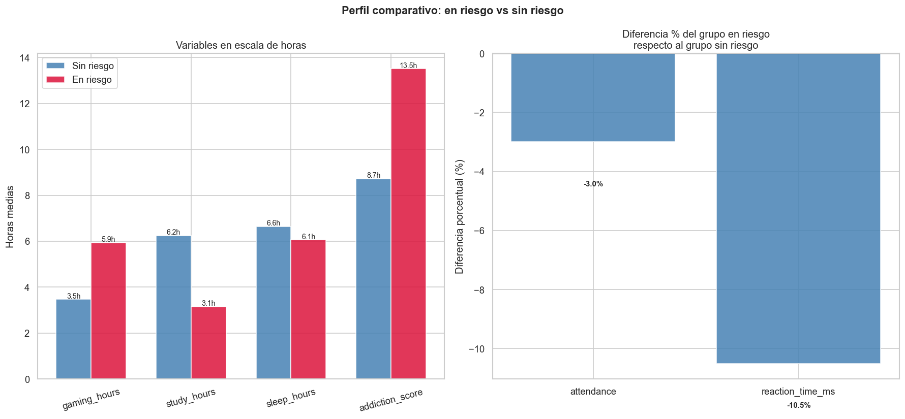
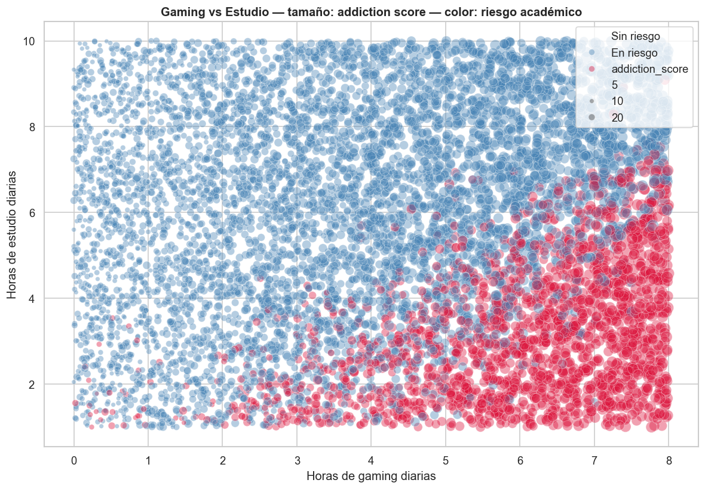
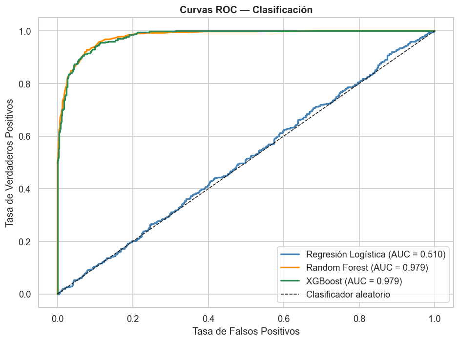
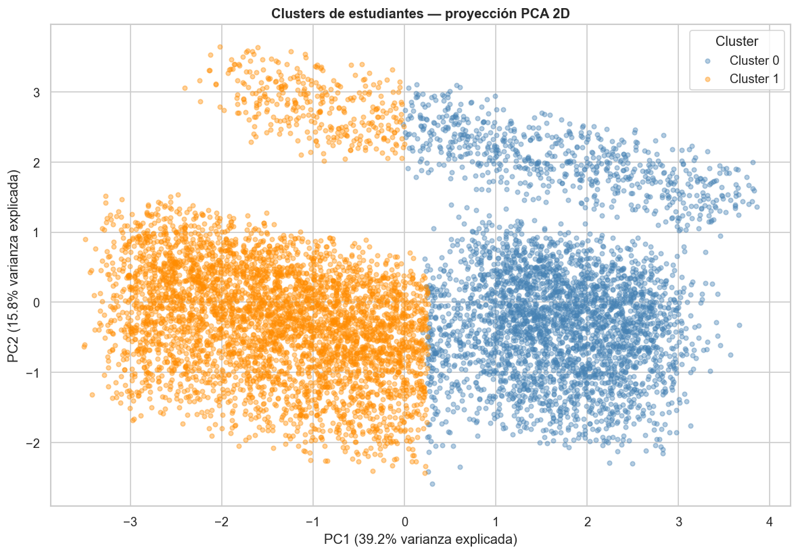

# 🎮 Gaming vs Academic Performance

**Autor:** Alejandro Román González · [@alegonzjur](https://github.com/alegonzjur)

**Repositorio:** [GamingAcademicPerformance](https://github.com/alegonzjur/GamingAcademicPerformance)

**Dataset:** [Kaggle — Gaming vs Academic Performance](https://www.kaggle.com/datasets/aiexplorer77/gaming-vs-academic-performance) 


   

## 📌 Descripción 

Proyecto end-to-end de análisis y ciencia de datos que estudia la relación entre los hábitos de entretenimiento gaming y el rendimiento académico de aproximadamente 8000 estudiantes universitarios.

El pipeline abarca desde la limpieza de datos hasta el modelado predictivo con Machine Learning, con los resultados finales visualizados en un dashboard interactivo de PowerBI. 

**Preguntas que responde este proyecto:**
- ¿Las horas de gaming tienen importancia en el rendimiento académico?
- ¿Existe un umbral de horas de juego a partir del cual el impacto es significativo?
- ¿Qué variables protegen el rendimiento pese a un gaming intensivo?
- ¿Es posible identificar perfiles de estudiante en riesgo académico?

## 🔄 Pipeline

01_limpieza_datos.ipynb
		↓
02_eda.ipynb
		↓
03_modelo_ml.ipynb
		↓
Dashboard Power BI

| Fase | Notebook                  | Descripción                                              | Estado         |
| ---- | ------------------------- | -------------------------------------------------------- | -------------- |
| 1    | `01_limpieza_datos.ipynb` | Auditoría, corrección de anomalías y variables derivadas | ✅ Completado   |
| 2    | `02_eda.ipynb`            | Análisis exploratorio y visualizaciones                  | ✅ Completado   |
| 3    | `03_modelo_ml.ipynb`      | Clasificación, regresión y clustering                    | ✅ Completado   |
| 4    | Power BI                  | Dashboard ejecutivo interactivo                          | 🔄 En progreso |

## 🛠️ Tecnologías

| Herramienta                | Uso en el proyecto                               |
| -------------------------- | ------------------------------------------------ |
| Python 3.11                | Lenguaje principal                               |
| Pandas / NumPy             | Limpieza y manipulación de datos                 |
| Matplotlib / Seaborn       | Visualización y análisis exploratorio            |
| Scikit-learn               | Modelos de clasificación, regresión y clustering |
| XGBoost                    | Gradient Boosting                                |
| VS Code / Jupyter Notebook | Entorno de desarrollo                            |
| Power BI                   | Dashboard ejecutivo interactivo                  |
## ## 📁 Estructura del repositorio

```
GamingAcademicPerformance/
│
├── data/
│   ├── Gaming_Academic_Performance.csv          # Dataset original
│   └── GAP_clean.csv                            # Dataset tras limpieza
│
├── img/                                  # Guarda los gráficos creados.
│   ├── fig_anomalias_previas.png
│   ├── fig_distribuciones_numericas.png
│   ├── fig_correlacion.png
│   ├── fig_gaming_vs_grades.png
│   ├── fig_perfil_riesgo.png
│   ├── fig_multivariado_gaming_estudio.png
│   └── fig_pairplot.png
│
├── 01_data_cleaning.ipynb
├── 02_eda.ipynb
├── 03_ml_modeling.ipynb        # Próximamente
└── README.md
```

## 🔍 Hallazgos principales

Estas son las conclusiones extraídas del análisis exploratorio sobre 8000 estudiantes universitarios.

### Gaming y rendimiento:

- Las horas de gaming muestran una relación negativa con las calificaciones, por supuesto más intensa cuanto mayores son las horas de gaming.

- El 'addiction_score' refuerza el patrón; los estudiantes con mayor puntuación de adicción tienden a obtener peores notas.

- El género del juego no tiene demasiado impacto en las notas o la puntuación de adicción.

### Factores protectores del rendimiento:

- Más horas de sueño se asocian consistentemente a mejores calificaciones.

- Mayor asistencia a clase muestra mejores notas, pero una diferencia poco significante.

- Las horas de estudio son el predictor positivo más claro de las calificaciones.

### Hallazgos contraintuitivos:

- Los estudiantes con mayor nivel de estrés obtienen mejores notas en promedio. La interpretación dada es que el estrés académico puede ser indicador de mayor implicación y exigencia personal sobre los estudios.

- Los estudiantes en riesgo reaccionan más rápido que aquellos con mejores notas. Esto quiere decir que el gaming intensivo desarrolla mayor agilidad cognitiva. Por otro lado, implica mayor dejadez en los estudios.

### Perfil del estudiante en riesgo:

- Más horas de gaming y mayor 'addiction_score'.

- Menos horas de estudio y menor asistencia a clase.

- Mayor velocidad de reacción.


## 📊 Visualizaciones destacadas

### Matriz de correlación



### Perfil comparativo: En riesgo vs Sin riesgo



### Gaming, estudio y riesgo académico



### Curvas ROC - comparativa de clasificadores



### Clusters de estudiantes - Proyección PCA 2D



## Resultados del modelado

### Clasificación - Predicción de riesgo académico

El objetivo de este modelo es predecir si un estudiante obtendrá una calificación inferior a 50.

| Modelo              | Accuracy | Precision | Recall    | F1-Score | ROC-AUC   |
| ------------------- | -------- | --------- | --------- | -------- | --------- |
| Logistic Regression | ~0.75    | bajo      | bajo      | bajo     | ~0.75     |
| Random Forest       | ~0.95    | **mayor** | ~0.85     | ~0.85    | 0.979     |
| **XGBoost ✅**       | ~0.95    | ~0.85     | **mayor** | ~0.85    | **0.979** |
**Modelo seleccionado: XGBoost**
En este contexto, el Recall es la métrica prioritaria. El recall (o sensibilidad) es la métrica que cuantifica la proporción de casos reales que el modelo identifica correctamente. Centrándonos en esta métrica, estamos priorizando detectar todos los estudiantes en riesgo aunque exista algún falso positivo. XGBoost obtiene mayor recall que Random Forest con un identico ROC-AUC.

---
### Regresión - Predicción de calificación exacta

El objetivo de este modelo es predecir la nota numérica del estudiante.

| Modelo | RMSE | MAE | R² |
|---|---|---|---|
| Linear Regression | 6.93 | 5.51 | 0.90 |
| **Random Forest ✅** | **6.11** | **4.72** | **0.92** |
| XGBoost | 37.59 | 31.31 | -1.87 |
**Modelo seleccionado: Random Forest**
Explica el 92% de la variabilidad de las notas con un error medio de 4.72 puntos. XGBoost muestra unos resultados muy deficientes con los hiperparámetros por defecto, demostrando que una mayor complejidad de modelo no implica un mejor rendimiento sin ajuste previo.

---
### Clustering — Segmentación de perfiles

K-Means con k=2 identifica dos perfiles naturales de estudiante:

| Perfil | gaming_hours | study_hours | grades | Riesgo |
|---|---|---|---|---|
| 🔴 Comprometido en riesgo | Alto | Alto | 55.9 | 40% |
| 🟢 Equilibrado | Bajo | Bajo | 74.4 | 10% |
El gaming intensivo daña el rendimiento incluso cuando el estudiante intenta compensarlo con más horas de estudio.

---
### Feature Importance

Los tres predictores más importantes coinciden en clasificación y regresión:

| Ranking | Variable | Interpretación |
|---|---|---|
| 🥇 1º | `study_hours` | Estudiar más es el factor protector más potente |
| 🥈 2º | `gaming_hours` | Gaming excesivo es el factor de riesgo más potente |
| 🥉 3º | `sleep_hours` | El descanso es el tercer pilar del rendimiento |
La coincidencia del ranking entre dos modelos de arquitectura distinta confirma la robustez de estos hallazgos.